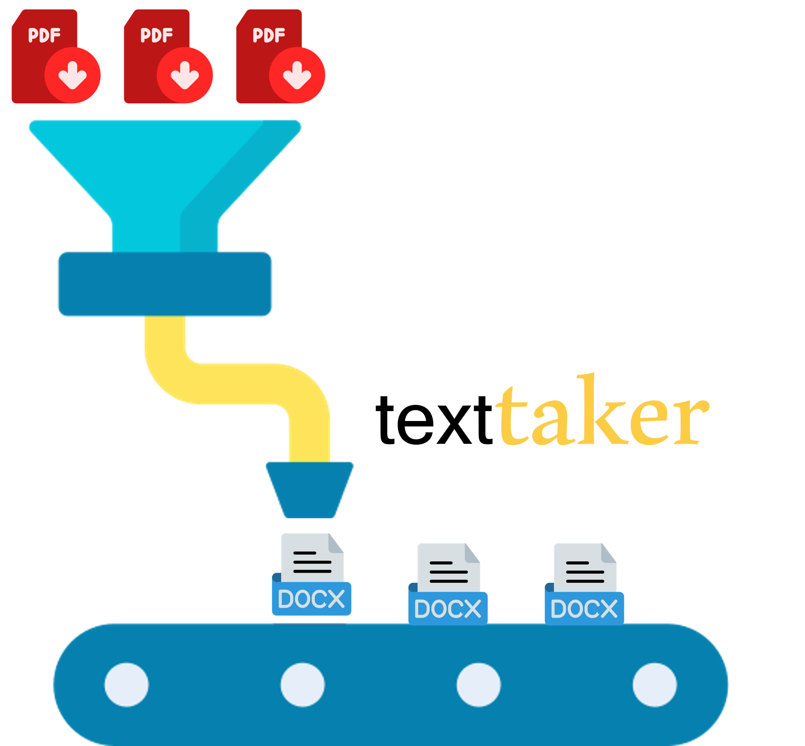

 

 
 
<h1 style="text-align: left;">text$\color[rgb]{0.99,0.8,0.27} taker$</h1>

This package implements OCR paradigms and extract text from PDF using more than one process to reduce time processing. Allows the user to write the information taken from pdf to MS Office Word doc.

